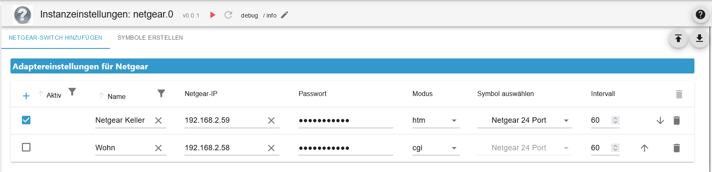
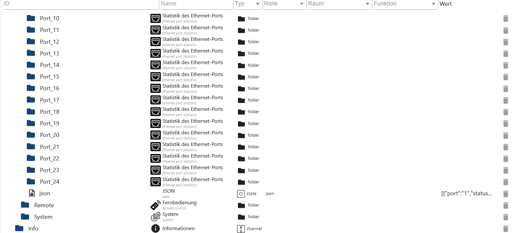
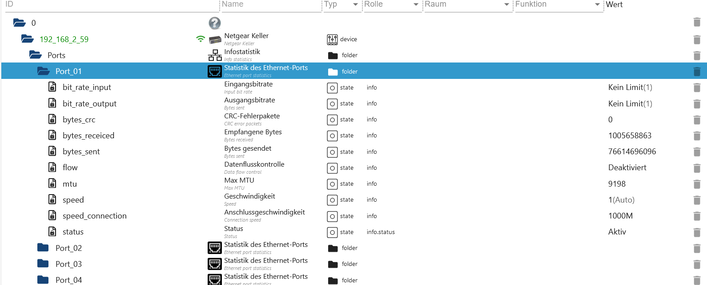

# ioBroker.netgear

[Zurück zur README](/README.md)

# Zusammenfassung

-   [Ordnerübersicht](#netgear)
-   [Instanz Einstellungen](#instanz-einstellungen)
    -   [Einstellungen TAB Netgear](#instanz-konfiguration-tab-netgear-erstellen)
    -   [Einstellungen TAB Symbole](#instanz-konfiguration-tab-symbole-erstellen)
-   [Remote Steuerung](#remote)
-   [Ports](#ports)
-   [System](#system)

# Netgear

# Instanz Einstellungen

### Instanz Konfiguration TAB Netgear erstellen

[Zusammenfassung](#zusammenfassung)

-   `Aktiv` Netgear Switch aktivieren/deaktivieren
-   `Name` Name
-   `Netgear-IP` IP vom Netgear Switch
-   `Passwort` Passwort
-   `Modus` Modus (htm oder cgi)
-   `Symbol auswählen` Das Icon wird unter Objekte angezeigt. Muss erst unter `Symbole erstellen` angelegt werden
-   `Intervall` Intervall in Minuten (Standard 60 Minuten)

### Instanz Konfiguration TAB Symbole erstellen

-   `Symbolname` Name für das Bild. Kann dann unter `Netgear hinzufügen` ausgewählt werden
-   `Upload` Icon hochladen

### Remote

[Zusammenfassung](#zusammenfassung)

-   `Remote.cable_testing` Kabeltest Ports als Array Bsp. [1,2,5,8]
-   `Remote.cable_testing_result` Ergebnis Kabeltest als JSON
-   `Remote.flow_change` States `flow_select_port`, `flow_select_speed` und `flow_select_status` übertragen
-   `Remote.flow_select_port` Port
-   `Remote.flow_select_speed` Geschwindigkeit
-   `Remote.flow_select_status` aktivieren/deaktivieren
-   `Remote.name` Name ändern
-   `Remote.rate_change` States `rate_input`, `rate_select_port` und `rate_output` anwenden
-   `Remote.rate_input` Eingangsrate
-   `Remote.rate_output` Ausgangsrate
-   `Remote.rate_select_port` Port
-   `Remote.reboot` Netgear reboot
-   `Remote.request_get` GET Anfrage
-   `Remote.request_post` POST Anfrage
-   `Remote.request_post_data` Daten für POST
-   `Remote.request_response` Antwort von GET oder POST
-   `Remote.update` Alle Daten aktualisieren

### Ports

[Zusammenfassung](#zusammenfassung)

-   `Ports.Port_01.bit_rate_input` Ausgangsrate
-   `Ports.Port_01.bit_rate_output` Eingangsrate
-   `Ports.Port_01.bytes_crc` CRC Fehler
-   `Ports.Port_01.bytes_receiced` empfangene Bytes
-   `Ports.Port_01.bytes_sent` gesendete Bytes
-   `Ports.Port_01.flow` Flusssteuerung
-   `Ports.Port_01.mtu` MAX MTU
-   `Ports.Port_01.speed` Geschwindigkeit
-   `Ports.Port_01.speed_connection` Verbindungsgeschwindigkeit
-   `Ports.Port_01.status` Status
-   `Ports.json` JSON Table für VIS

 
 
 

### System

[Zusammenfassung](#zusammenfassung)

-   `System.cookie` Aktuelle Cookie
-   `System.firmware` Firmware
-   `System.bootloader` Bootloader (nicht für alle Geräte)
-   `System.ip` IP vom Netgear Switch
-   `System.lastupdate` Letzte Update
-   `System.mac` MAC Adresse
-   `System.name` Nmae vom Netgear Switch
-   `System.online` Online
-   `System.productname` Produktname
-   `System.serialnumber` Seriennummer

[Zusammenfassung](#zusammenfassung)
