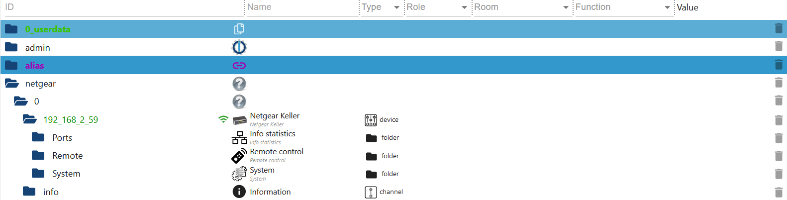
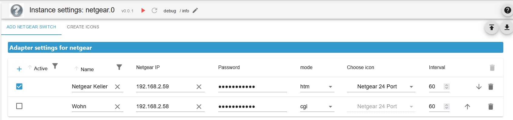
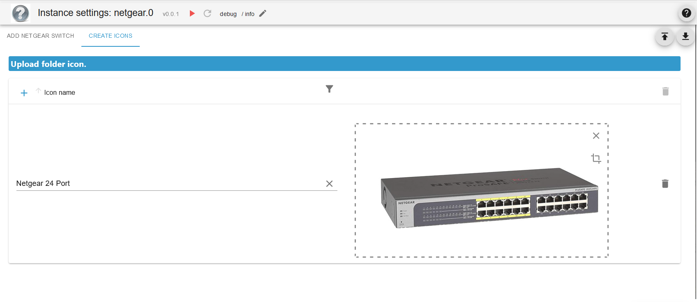
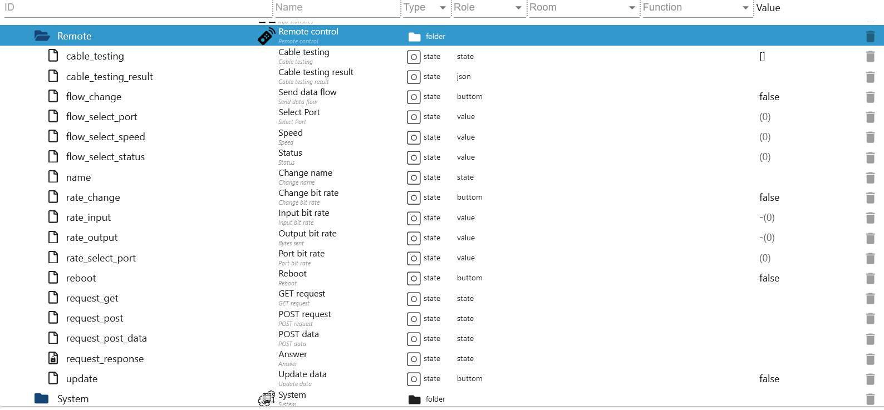
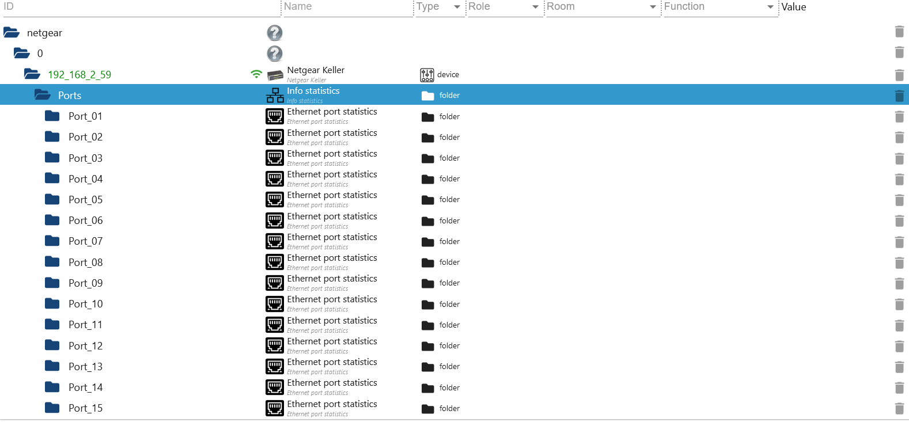
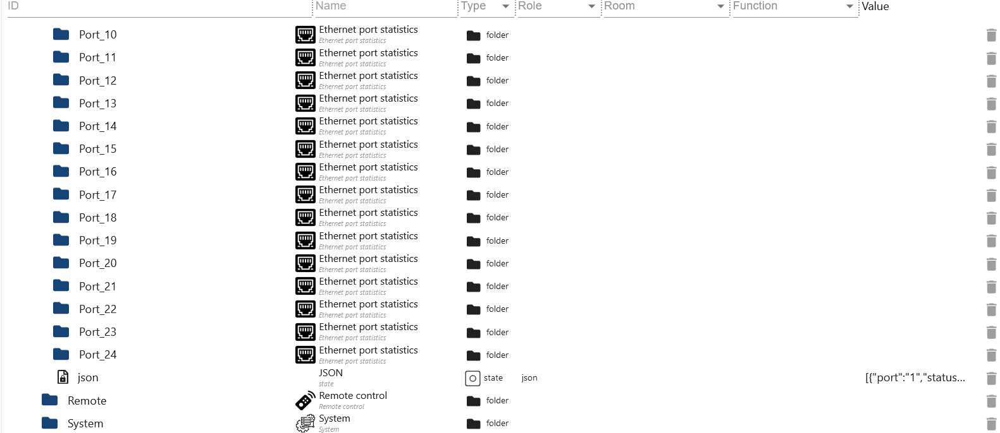
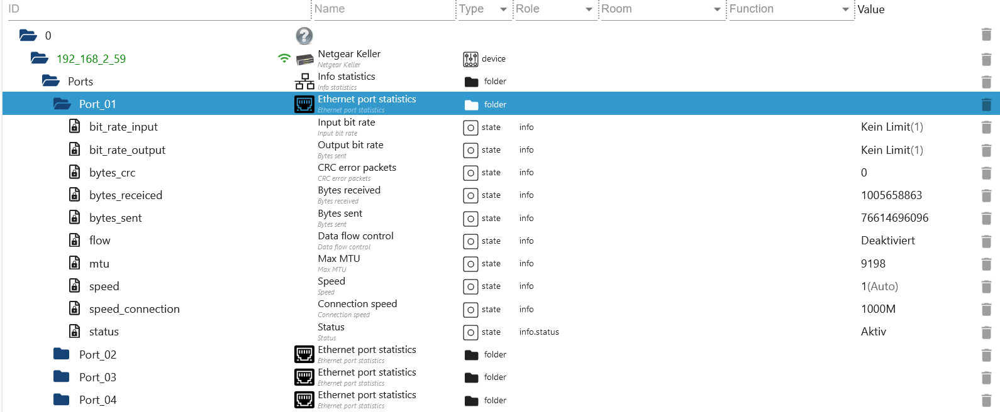
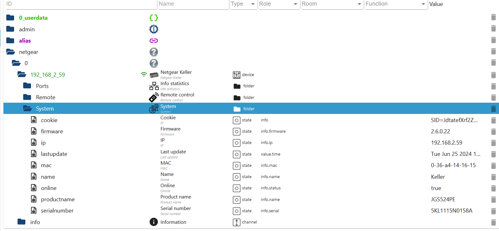

# ioBroker.netgear

[Back to README](/README.md)

# Summary

-   [Folder overview](#netgear)
-   [Instance Settings](#instance-settings)
    -   [TAB Netgear settings](#create-netgear)
    -   [TAB Symbole settings](#create-symbole)
-   [Remote control](#remote)
-   [Ports](#ports)
-   [System](#system)

# Netgear



# Instance Settings

### Create Netgear

[Summary](#summary)

-   `Activ` Netgear Switch activate/deactivate
-   `Name` Name
-   `Netgear IP` IP from Netgear Switch
-   `Password` Password
-   `mode` Mode (htm or cgi)
-   `Choose icon` The icon is displayed under Objects. Must first be created under `Choose icon`
-   `Intervall` Intervall in mintes (default 60 minutes)



### Create symbole

-   `Symbolname` Name of the image. Can then be selected under `ADD Netgear Switch`.
-   `Upload` Upload icon



### Remote

[Summary](#summary)

-   `Remote.cable_testing` cable test ports as an array example [1,2,5,8]
-   `Remote.cable_testing_result` Cable test result as JSON
-   `Remote.flow_change` states `flow_select_port`, `flow_select_speed` and `flow_select_status` apply
-   `Remote.flow_select_port` port
-   `Remote.flow_select_speed` speed Enable/disable
-   `Remote.flow_select_status`
-   `Remote.name` Change name
-   `Remote.rate_change` states `rate_input`, `rate_select_port` and `rate_output` apply
-   `Remote.rate_input` Input rate
-   `Remote.rate_output` Output rate
-   `Remote.rate_select_port` port
-   `Remote.reboot` Netgear reboot
-   `Remote.request_get` GET request
-   `Remote.request_post` POST request
-   `Remote.request_post_data` data for POST
-   `Remote.request_response` response from GET or POST
-   `Remote.update` Update all data



### Ports

[Summary](#summary)

-   `Ports.Port_01.bit_rate_input` Output rate
-   `Ports.Port_01.bit_rate_output` input rate
-   `Ports.Port_01.bytes_crc` CRC error
-   `Ports.Port_01.bytes_receiced` received bytes
-   `Ports.Port_01.bytes_sent` bytes sent
-   `Ports.Port_01.flow` flow control
-   `Ports.Port_01.mtu` MAX MTU
-   `Ports.Port_01.speed` speed
-   `Ports.Port_01.speed_connection` connection speed
-   `Ports.Port_01.status` status
-   `Ports.json` JSON Table for VIS

```JSON
[
  {
    "port": "1",
    "status": "Aktiv",
    "speed": "Auto",
    "speed_connection": "1000M",
    "flow": "Deaktiviert",
    "mtu": 9198,
    "bytes_receiced": 1030367945,
    "bytes_sent": 78275225439,
    "bytes_crc": 0,
    "bit_rate_input": "Kein Limit",
    "bit_rate_output": "Kein Limit"
  },
  {
    "port": "2",
    "status": "Aktiv",
    "speed": "Auto",
    "speed_connection": "1000M",
    "flow": "Deaktiviert",
    "mtu": 9198,
    "bytes_receiced": 57788792694,
    "bytes_sent": 4557799736,
    "bytes_crc": 1,
    "bit_rate_input": "Kein Limit",
    "bit_rate_output": "Kein Limit"
  }
]
```

</br>
</br>
</br>

### System

[Summary](#summary)

-   `System.cookie` Current cookie
-   `System.firmware` firmware
-   `System.bootloader` bootloader (not for all devices)
-   `System.ip` IP from Netgear Switch
-   `System.lastupdate` Last update
-   `System.mac` MAC address
-   `System.name` Nmae from Netgear Switch
-   `System.online` Online
-   `System.productname` Product name
-   `System.serialnumber` serial number



[Summary](#summary)
